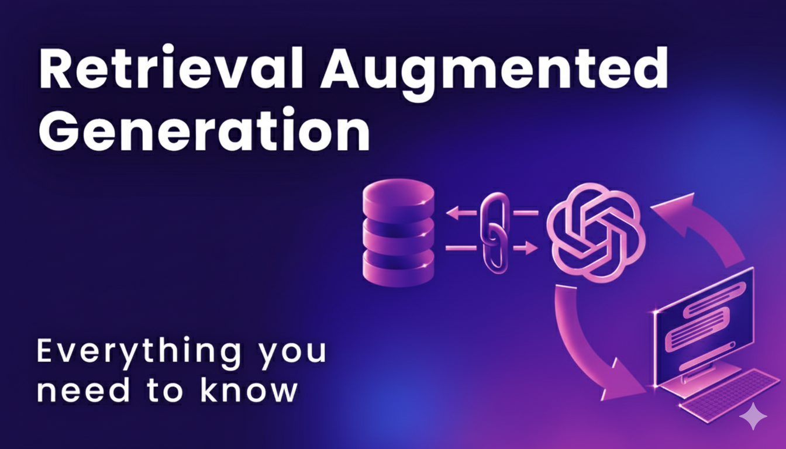

# RAG-from-Scratch-with-LangChain-and-LangGraph

<p align="center">
  
</p>

<p align="center">
  
  
  
  
  
  
</p>

---

Welcome to the **RAG from Scratch** repository! This is a complete, hands-on bootcamp for building advanced Retrieval-Augmented Generation (RAG) systems from the ground up. This repository contains a series of Jupyter notebooks that will guide you through every stage of the RAG pipeline, from fundamental data processing with **LangChain** to building advanced, autonomous agents with **LangGraph**.

---

## 📖 Course Structure

This course is divided into distinct sections, each building upon the last. You will start by learning how to prepare your data and finish by building sophisticated, self-correcting RAG agents.

### Section 1: Data Ingestion and Parsing
Before you can build a RAG system, you need data. This section covers how to load, parse, and clean documents from a wide variety of common sources.

* **Notebooks**:
    * `01_Data_Ingestion.ipynb`: Loading simple `.txt` files.
    * `02_Parsing_PDF_Documents.ipynb`: Handling complex PDFs and building cleaning pipelines.
    * `03_Parsing_Word_Documents.ipynb`: Using structure-aware loaders for `.docx` files.
    * `04_Parsing_Structured_Data_CSV_and_Excel.ipynb`: Converting tabular data into a text format for RAG.
    * `05_Parsing_JSON_Data.ipynb`: Handling nested JSON and JSON Lines formats.
    * `06_Parsing_SQL_Databases.ipynb`: Extracting schema and content from relational databases.

### Section 2: Vector Embeddings
This section dives into the core of semantic search: vector embeddings. You'll learn what they are, how they capture meaning, and how to create them.

* **Notebooks**:
    * `01_HuggingFace_Embeddings.ipynb`: Understanding embeddings and cosine similarity, and creating embeddings with open-source Hugging Face models.
    * `02_OpenAI_Embeddings.ipynb`: Using proprietary models like OpenAI and building a simple semantic search function from scratch.

### Section 3: Vector Stores
Once you have embeddings, you need a specialized database to store and search them efficiently. This section explores different types of vector stores, from local libraries to managed cloud services.

* **Notebooks**:
    * `01_Traditional_RAG_with_Chromadb.ipynb`: Your first end-to-end RAG pipeline using a local, persistent database.
    * `02_Building_RAG_with_FAISS.ipynb`: Using the blazingly fast, in-memory FAISS library for retrieval.
    * `03_Pinecone_VectorDB.ipynb`: Integrating with a fully managed, cloud-native vector database for production-scale applications.

### Section 4: Advanced Chunking and Preprocessing
The quality of your RAG system is highly dependent on the quality of your data chunks. This section moves beyond simple fixed-size splitting to more intelligent, context-aware methods.

* **Notebook**:
    * `1_Semantic_Chunking.ipynb`: Splitting documents based on semantic meaning rather than character count to create more coherent chunks.

### Section 5: Hybrid Search Strategies
Sometimes, semantic search alone isn't enough. This section covers how to combine the best of both worlds: semantic understanding and precise keyword matching.

* **Notebooks**:
    * `1_Hybrid_Search-Dense_Sparse.ipynb`: Implementing hybrid search by combining a dense retriever (FAISS) and a sparse retriever (BM25) to improve retrieval accuracy.
    * `3_Reranling.ipynb`: Using an LLM as a second-stage reranker to improve the precision of retrieved documents.
    * `5_MMR.ipynb`: Using Maximal Marginal Relevance to retrieve a more diverse and comprehensive set of documents.

### Section 6: Query Enhancement
The user's query is the starting point for everything. This section explores techniques to automatically improve user queries *before* they hit the retrieval system.

* **Notebooks**:
    * `1_Query_Expansion_Technique.ipynb`: Using an LLM to expand a user's short or ambiguous query with synonyms and related terms.
    * `3_Query_Decomposition.ipynb`: Breaking down a complex, multi-part question into simpler sub-questions that are answered individually.
    * `5_HyDE.ipynb`: Generating a hypothetical document to bridge the semantic gap between a question and its answer.

### Section 7 & 8: Agentic & Corrective RAG
This is where we move beyond linear pipelines into dynamic, intelligent systems. Using **LangGraph**, we build agents that can reason, use tools, and even correct their own mistakes.

* **Notebooks**:
    * `1_Agentic_RAG.ipynb`: Building an agent that can intelligently choose the correct retrieval tool from multiple options based on the user's query.
    * `1_Corrective_RAG.ipynb`: Creating an advanced, self-correcting agent that can grade the relevance of retrieved documents and fall back to web search if its initial retrieval fails.

---

## 🚀 Getting Started

1.  **Clone the repository:**
    ```bash
    git clone [https://github.com/your-username/RAG-from-Scratch-with-LangChain-and-LangGraph.git](https://github.com/your-username/RAG-from-Scratch-with-LangChain-and-LangGraph.git)
    cd RAG-from-Scratch-with-LangChain-and-LangGraph
    ```

2.  **Set up a virtual environment:**
    ```bash
    python -m venv .venv
    source .venv/bin/activate  # On Windows, use `.venv\Scripts\activate`
    ```

3.  **Install dependencies:**
    A `requirements.txt` file should be provided in the repository for easy setup.
    ```bash
    pip install -r requirements.txt
    ```

4.  **Set up API Keys:**
    Many notebooks require API keys for services like OpenAI, Groq, and Tavily. Create a `.env` file in the root directory and add your keys:
    ```
    OPENAI_API_KEY="sk-..."
    GROQ_API_KEY="gsk_..."
    TAVILY_API_KEY="tvly-..."
    PINECONE_API_KEY="..."
    ```

5.  **Run Jupyter Notebook:**
    ```bash
    jupyter notebook
    ```
    Now you can open and run the notebooks in order, starting from the first section. Enjoy the journey!

---

## Acknowledgements

This repository and the content within the notebooks were created by following and building upon the concepts taught in the **"Ultimate RAG Bootcamp Using LangChain,LangGraph&LangSmith"** course on Udemy. A huge thank you to [Krish Naik](https://github.com/krishnaik06) for providing a comprehensive and practical guide to building advanced RAG systems.

You can find the course here: [Udemy - Ultimate RAG Bootcamp](https://www.udemy.com/course/ultimate-rag-bootcamp-using-langchainlanggraph-langsmith/)
